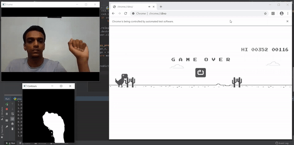

# hand-gesture-dino-run

Playing Google Chrome's dino run game using hand gestures.

### Description
The dino run game can be found at `chrome://dino` in the Chrome browser. Hand gesture detection is used to play this game. The "fist" gesture is considered as the normal state, and the "open palm" gesture is considered as the jump state.

### Steps
1) Create the gesture data set using `create_dataset.py`. 
2) Convert the images to a CSV file using `create_csv.py`.
3) Train the model using `Train Hand Gestures.ipynb` interactively or using `train_hand_gestures.py` silently.
4) Run `play_dinorun.py` to play the game.

Or to play the game using the trained model `hand_gesture.h5`, run `play_dinorun.py` directly.

This project is inspired by the idea of Akshay Bahadur's repository: [https://github.com/akshaybahadur21/Emojinator](https://github.com/akshaybahadur21/Emojinator)